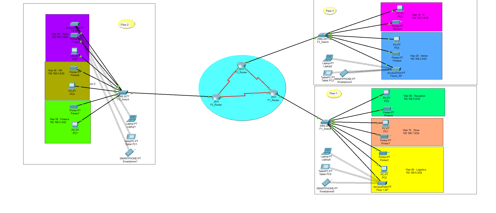

# Hotel System Network Design 

This project demonstrates the design and implementation of a network for Vic Modern Hotel, consisting of three floors, each with distinct departments. The network is designed using **Cisco Packet Tracer**, and features include **VLANs**, **OSPF routing**, **DHCP servers**, **SSH configuration**, and **port security**. The network is set up to ensure smooth communication between all departments and devices.

---

## Network Architecture

The Vic Modern Hotel has the following layout:

### 1st Floor:
- **Departments**:
  - Reception (VLAN 80)
  - Store (VLAN 70)
  - Logistics (VLAN 60)
- **Devices**:
  - Each department has its own switch and printer.
  - Wi-Fi access points for laptops and phones.
  
### 2nd Floor:
- **Departments**:
  - Finance (VLAN 50)
  - HR (VLAN 40)
  - Sales/Marketing (VLAN 30)
- **Devices**:
  - Each department has its own switch and printer.
  - Wi-Fi access points for laptops and phones.

### 3rd Floor:
- **Departments**:
  - Admin (VLAN 20)
  - IT (VLAN 10)
- **Devices**:
  - Servers, switches, and Test-PC for SSH testing.

### Key Network Devices:
- **Routers**: 3 routers (one per floor, located in the IT department).
- **Switches**: 1 switch per floor.
- **Wi-Fi Access Points**: 1 access point per floor.
- **Printers**: 1 printer per department.
  
The routers are connected via **serial DCE cables**, and OSPF routing is used for inter-floor communication.

---

## IP Addressing Scheme

The following IP address ranges have been assigned to each department:

### 1st Floor:
- **Reception**: VLAN 80, Network 192.168.8.0/24
- **Store**: VLAN 70, Network 192.168.7.0/24
- **Logistics**: VLAN 60, Network 192.168.6.0/24

### 2nd Floor:
- **Finance**: VLAN 50, Network 192.168.5.0/24
- **HR**: VLAN 40, Network 192.168.4.0/24
- **Sales/Marketing**: VLAN 30, Network 192.168.3.0/24

### 3rd Floor:
- **Admin**: VLAN 20, Network 192.168.2.0/24
- **IT**: VLAN 10, Network 192.168.1.0/24

### Router-to-Router Connection IPs:
- **Router 1 - Router 2**: 10.10.10.0/30 (Router 1: 10.10.10.1, Router 2: 10.10.10.2)
- **Router 2 - Router 3**: 10.10.10.4/30 (Router 2: 10.10.10.5, Router 3: 10.10.10.6)
- **Router 1 - Router 3**: 10.10.10.8/30 (Router 1: 10.10.10.9, Router 3: 10.10.10.10)

---

## Technologies Implemented

### 1. **Network Topology Design**
- The network was designed using **Cisco Packet Tracer** and includes routers, switches, and devices arranged across three floors.
  
### 2. **VLANs and IP Addressing**
- Each department has been assigned its own VLAN and subnet to separate traffic between them.
  
### 3. **OSPF Routing**
- OSPF was configured to enable dynamic routing between routers, ensuring that each floor's devices can communicate with one another.
  
### 4. **DHCP Configuration**
- Each router is configured as a **DHCP server**, providing IP addresses dynamically to all devices in the network.
  
### 5. **SSH Configuration**
- SSH was enabled on all routers for secure remote login.

### 6. **Port Security**
- **Port security** was configured on the IT department switch to allow only the **Test-PC** to access port `fa0/1`. The **sticky MAC address** method was used with a **shutdown violation mode**.

### 7. **Wireless Network (WLAN)**
- **Wi-Fi networks** were set up for all floors using **Cisco Access Points**, allowing wireless devices (laptops and phones) to connect to the network.

---

## Configuration Steps

### Step 1: **Network Device Setup**
1. Add 3 routers (one per floor) in the Packet Tracer workspace.
2. Add 3 switches (one per floor) and connect them to the respective routers.
3. Set up the **Wi-Fi Access Points** on each floor.
4. Configure each **department’s switch** with its respective VLAN.

### Step 2: **IP Addressing**
1. Assign the IP addresses to each router's interface (including serial links).
2. Assign each device (PC, printer, Wi-Fi AP) a dynamic IP address from the respective router’s DHCP pool.

### Step 3: **Routing and DHCP Configuration**
1. Configure **OSPF routing** on all routers to allow them to advertise routes.
2. Set up **DHCP** on each router for dynamic IP allocation to devices in each VLAN.
  
### Step 4: **Port Security on IT Switch**
1. Configure **port security** on the IT department switch to allow only the **Test-PC**'s MAC address to access port `fa0/1` using the **sticky** method.
2. Set the violation mode to **shutdown** to block unauthorized devices.

### Step 5: **SSH Configuration**
1. Enable **SSH** on all routers to allow remote access.
2. Set up user authentication and RSA keys for secure login.

### Step 6: **Testing**
1. Test connectivity between devices across different floors and departments.
2. Ensure the **Test-PC** can SSH into the routers.
3. Check that all devices receive IP addresses via DHCP.
4. Test port security by disconnecting and reconnecting unauthorized devices.

---

## Verification

After completing the configurations, verify the following:

1. **Ping Tests**: Test connectivity between devices across different VLANs.
2. **DHCP**: Verify that all devices get IP addresses dynamically.
3. **SSH**: Test remote access to the routers via SSH.
4. **Port Security**: Ensure that only **Test-PC** can access the IT department’s switch port.
5. **OSPF Routing**: Verify that routes are advertised correctly across the routers using `show ip route`.

---

## Screenshots & Files

- **Network Architecture**: [Link to Screenshot ](1.png)
- **Packet Tracer File**: [Link to .pkt file](P3_Hotel_System_Network.pkt)
---

## Conclusion

This project demonstrates the implementation of a complex hotel network setup, ensuring that each department can communicate efficiently while maintaining security. The implementation of OSPF routing, DHCP, SSH, and port security provides a robust solution for the Vic Modern Hotel's network.

---

